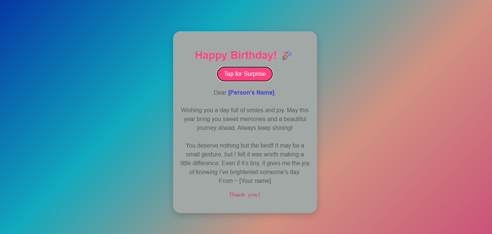

# Birthday Template
> Your one to go birthday template for your friends.
Made using the HTML ,CSS and a bit of JS.

## How to use?
1. Save this file as `Birthday-Card-For-Friends.html`.
2. Commit it to a GitHub repo and enable GitHub Pages (select main branch / root) to publish.
3. Open the URL provided by GitHub Pages and share the link.

## What's inside?
- Responsive mobile-first design
- Click-to-reveal formatted birthday message
- Easy-to-edit friend name and message in the HTML
  
A mobile-friendly, ready-to-post single-file HTML birthday card you can host on GitHub Pages or share directly hosting on websites like [Netlify](https://www.netlify.com/),[Render](https://render.com/),etc..
  

## Author
Lalitha N

